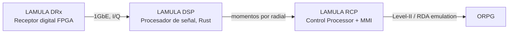

# LAMULA — Documentación del proyecto

LAMULA es el reemplazo integral, en software propio, del stack de procesamiento y control del radar meteorológico Gematronik (sucesor de Vesta DRX / Ravis / Rainbow). El proyecto se divide en tres componentes que comparten equipo y cronograma:

- **[LAMULA DRx](drx-plan.md)** — receptor digital sobre FPGA: adquiere IF/I-Q desde el receptor analógico existente y lo entrega al DSP. Su plan y su documentación viven ahora en [su propio sitio](https://lamula-drx-docs.pages.dev/).
- **[LAMULA DSP](dsp-plan.md)** — procesador de señal headless en Rust sobre Linux SBC: convierte series de tiempo I/Q en momentos meteorológicos (reflectividad, velocidad, ancho espectral), reemplazando el stack Vesta DRX.
- **[LAMULA RCP](rcp-plan.md)** — Radar Control Processor y MMI del operador: controla el radar, archiva la observación volumétrica como NEXRAD Level-II y alimenta a ORPG vía emulación RDA.

Los formatos de cable que unen esos tres componentes están documentados aparte,
en **[Contratos de cable](contracts/index.md)**: qué contrato posee cada
proyecto, cómo se generan las implementaciones de cada lado desde un único
esquema, y cómo se comprueba que coinciden byte a byte.

## Referencia de producto líder de mercado

Para subir el nivel de detalle de estos planes se usaron como referencia estructural — **nunca como fuente de texto copiado** — dos manuales de productos líderes:

- **Vaisala RVP900** (procesador de señal de radar) → informó el detalle de **LAMULA DSP/DRx**, en particular el capítulo "Processing Algorithms". Los algoritmos concretos que ese capítulo cubre se documentan aquí con **fuentes públicas y abiertas** (papers, libros de referencia, implementaciones open-source), no con el texto del fabricante — ver [Algoritmos de procesamiento](algorithms/index.md).
- **Ravis 1.3** (consola de operador de radar) → informó el detalle de **LAMULA RCP**: pantallas de control, vistas de datos, calibración y alineación, diagnóstico del sistema.

Los manuales originales (con derechos de sus fabricantes) se usan solo como referencia local de trabajo y **no se versionan en este repositorio**.
